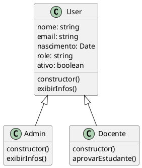

# JavaScript: programação orientada a objetos

# 1. Entendendo a orientação a objetos

```plantuml
@startuml Modelo
class User {
  nome: string
  email: string
  nascimento: Date
  role: string
  ativo: boolean
  constructor()
  exibirInfos()
}

class Admin {
  constructor()
  exibirInfos()
}

class Docente {
  constructor()
  aprovarEstudante()
}

hide Admin fields
hide Docente fields

User <|-- Admin
User <|-- Docente

@enduml
```